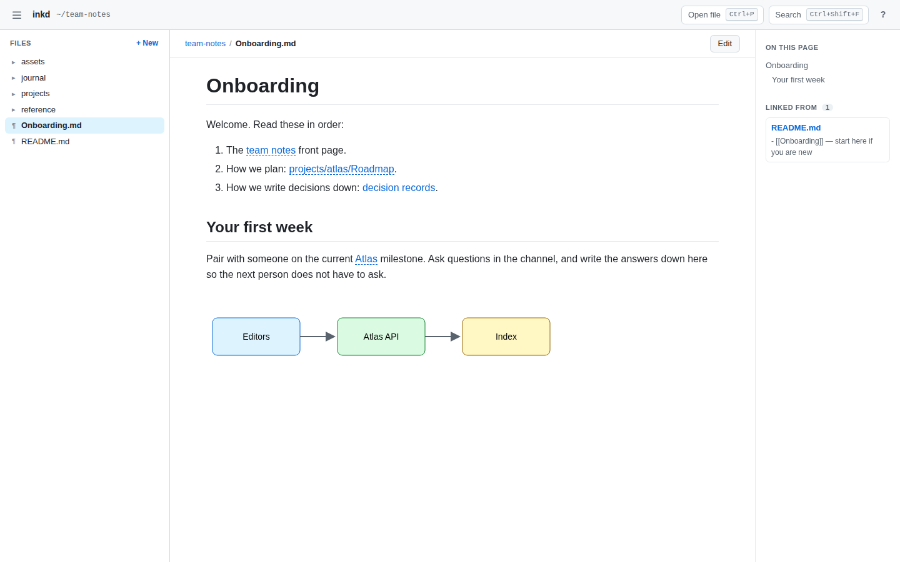
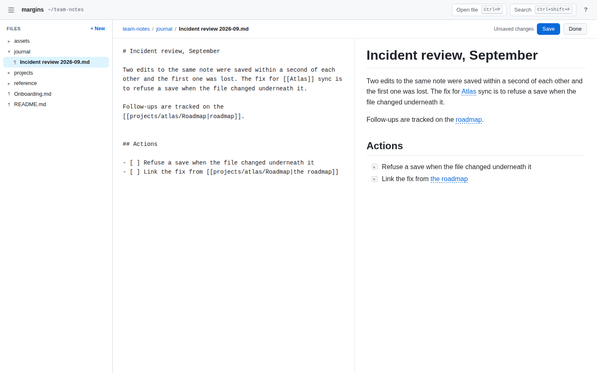
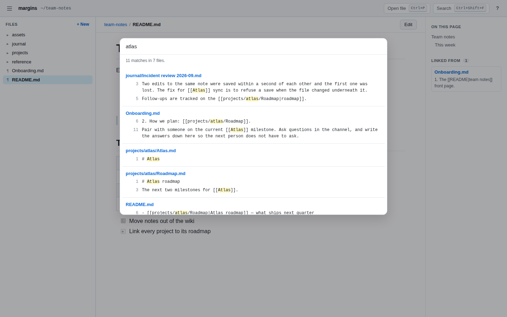
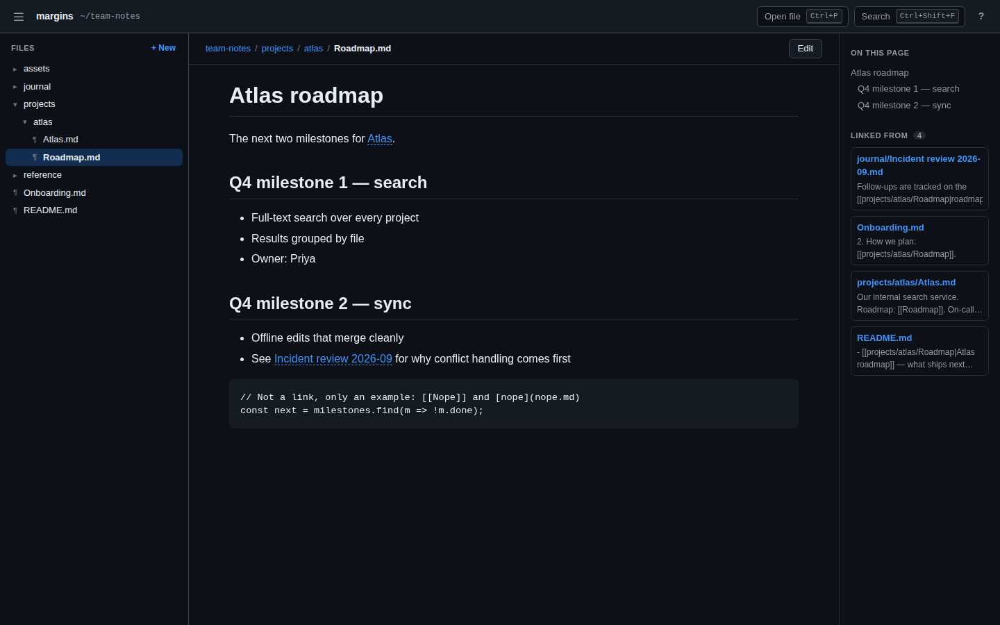

# margins

[](https://github.com/dheerajjha/margins/actions/workflows/ci.yml)
[](LICENSE)
[](package.json)
[](test/)
[](package.json)

Open any folder of markdown in your browser, from the terminal. Browse it as a
tree, read it rendered, follow the links between files — `[[wikilinks]]`
included — edit with a live preview, and search all of it. Close the tab when
you are done and it stops.

```bash
npm install -g margins

cd ~/notes
margins
```

No vault to create, no app to install, no account, nothing to configure. The
only thing margins ever writes into the folder is a file you save.



## Why

A folder of markdown is the most durable way to keep notes and docs there is.
Every editor opens it, git versions it, and it will still be readable in
twenty years. What is missing is a good way to *read* one.

- **Single-file editors** — MarkEdit, Typora, TextEdit — open one file at a
  time. There is no folder to see, so the links between files go nowhere.
- **Obsidian** is built around exactly this, but it is an application with a
  vault: it wants the folder registered, it writes a `.obsidian` directory into
  it, and you cannot point it at a repository's `docs/` from the terminal.
- **Markdown preview servers** — markserv, grip, md-fileserver — show a folder
  in the browser but only read it, and know nothing of `[[wikilinks]]`.

margins sits in between: the folder tree and linked notes of Obsidian, the
lightness of a single-file editor, started from the terminal in whatever folder
you are standing in — your notes, a project's `docs/`, a colleague's repository.

## What it does

- **Browse** the folder as a tree. Markdown first; other text files and images
  are there too.
- **Read** GitHub-flavoured markdown: tables, task lists, strikethrough, code
  blocks, images from the folder, and the HTML that READMEs use — `<details>`,
  `<kbd>`, ``.
- **Follow links** the way GitHub reads them — `[text](other.md#section)` — and
  the way Obsidian does — `[[Other]]`, `[[Other#Section]]`, `[[Other|alias]]`,
  `![[diagram.png]]`.
- **See what links here.** Every note shows the notes that link to it, by
  either kind of link, with the line that does.
- **Edit** with the source beside a live preview. `Ctrl/Cmd+S` saves.
- **Create** a note from the sidebar, or by clicking a `[[link]]` to a note that
  does not exist yet — the way Obsidian does it.
- **Open a file by name** (`Ctrl/Cmd+P`) and **search every file**
  (`Ctrl/Cmd+Shift+F`).
- **Keep up with other editors.** Change a file in vim, VS Code or with an
  agent, and the page shows the new version within two seconds.
- **Never lose an edit to one.** If the file changed on disk after you opened
  it, saving writes nothing and asks you which version to keep.





It follows your system's light or dark setting.



## Usage

```
margins [path] [options]
```

`path` is a folder, or a file inside the folder to open first. It defaults to
the current directory. A folder opens on its `README.md` or `index.md` if it has
one — the page you would start from on GitHub.

| Option | |
|---|---|
| `-p, --port <n>` | Port to listen on. Default 4600; if it is taken, a free one is used. |
| `--hidden` | Show hidden files and folders — names starting with a dot. |
| `--no-open` | Print the address instead of opening a browser. |
| `-v, --version` | Print the version. |
| `-h, --help` | Print the usage. |

```bash
margins                     # the folder you are in
margins ~/notes             # another one
margins docs/guide.md       # a repository's docs, opened on one page
npx margins                 # without installing it
```

margins stops when you close its last tab. A reload, or a second tab, keeps it
running; so does never opening a tab at all, if you would rather open the
address yourself later. `Ctrl+C` stops it any time.

### Keys

| Key | |
|---|---|
| `Ctrl/Cmd+P` | Open a file by name |
| `Ctrl/Cmd+Shift+F` | Search every file |
| `e` | Edit this file |
| `Ctrl/Cmd+S` | Save |
| `Esc` | Close a panel, or stop editing |
| `[` `]` | Back and forward |
| `?` | Every shortcut |

## How links are followed

A **relative link** is resolved from the file it is in, as GitHub does:
`[setup](../guide.md#install)` from `notes/a.md` opens `guide.md` at its
*install* heading. Heading anchors are made the way GitHub makes them, so a
link written for GitHub lands in the same place here.

A **wikilink** names a file, not a path, so it keeps working when notes move.
`[[Ideas]]` means the file called `Ideas.md` — and when several are, the one in
the linking note's own folder, then the shallowest, then the first
alphabetically, so the answer is always the same one. `[[projects/Ideas]]`
narrows it by path. A wikilink to a note that does not exist yet is shown in a
different colour, and clicking it creates the note.

Links written as examples inside code blocks and code spans are left alone, and
are not counted as links to anything.

## Safety

margins is meant to be pointed at folders you did not write — a cloned
repository, a colleague's notes — and it can write files. So it assumes the
folder might be hostile, and so might other websites open in the same browser.

- **Nothing in a markdown file can run.** Rendered HTML is sanitised with
  [DOMPurify](https://github.com/cure53/DOMPurify): no scripts, no event
  handlers, no `javascript:` links, no forms, frames, embedded SVG or inline
  styles. A strict Content-Security-Policy is the second lock: the page runs no
  script margins did not ship itself. Images are served in a sandbox, so even an
  SVG with a script in it only draws.
- **Nothing outside the folder can be read or written** — not with `..`, not
  with an absolute path, and not through a symlink inside the folder that points
  somewhere else.
- **`.git` and `node_modules` are never opened or written.** Writing
  `.git/hooks/pre-commit` would be running code on your next commit.
- **Other websites cannot use it.** It listens on `127.0.0.1` only; it answers
  no request addressed to any other name, which stops DNS rebinding; it accepts
  changes only from its own page; and it sends no CORS headers, so no other site
  can read what it serves.
- **Your own work is not lost to another program's.** Saving checks the file
  still holds what you opened, by content hash rather than timestamp.

Remote images — the badges at the top of most READMEs — are loaded, without a
referrer, so the image host is not told which file or folder they appeared in.

Each protection the server enforces has a test that fails without it — checked
by removing them one at a time. Sanitising happens in the browser, where the
test suite cannot reach, so it is checked there: against a markdown file that
tries every trick above, in a real browser, before each release.

## What it does not do

It is deliberately small. There is no graph view, no plugins, no sync, no
database and no index on disk — search and backlinks read the files each time,
which is fast for a folder of notes and slow for a folder of hundreds of
thousands of files, where margins stops at 20,000 and says so. Code blocks are
not syntax-highlighted yet. `![[Note]]` embeds are shown as links, not inlined.
Renaming and deleting are left to your file manager or editor. `.gitignore` is
not read.

## How it compares

| | Folder tree | Edit | Search | Wikilinks and backlinks | Start from a terminal | Writes into your folder |
|---|---|---|---|---|---|---|
| MarkEdit | — | yes | — | — | — | only what you save |
| Obsidian | yes | yes | yes | yes | — | a `.obsidian` folder |
| markserv | yes | — | yes | — | yes | nothing |
| SilverBullet | yes | yes | yes | yes | runs as a server | an index |
| **margins** | yes | yes | yes | yes | yes | only what you save |

## HTTP API

The page is a client of this; nothing is hidden from you.

| Endpoint | |
|---|---|
| `GET /api/info` | The folder, and the file to open first |
| `GET /api/tree?path=` | One folder's entries |
| `GET /api/files` | Every file below the folder |
| `GET /api/file?path=` | A file's content and version, or what kind of thing it is |
| `PUT /api/file` | Save `{path, content, version}`; 409 if the file changed |
| `POST /api/file` | Create `{path, content}`; 409 if it exists |
| `GET /api/version?path=` | A file's current version, for noticing changes |
| `GET /api/search?q=` | Matches across every text file |
| `GET /api/backlinks?path=` | What links to a file |
| `GET /raw/<path>` | An image from the folder |
| `GET /api/alive` | Held open by the page; when the last one closes, margins stops |

## Development

```bash
git clone https://github.com/dheerajjha/margins.git
cd margins && npm install
npm test                    # 80 tests
node bin/margins.js ~/notes
```

The server uses no packages at all — Node's own `http`, `fs` and `path`. The
two dependencies, [marked](https://github.com/markedjs/marked) and
[DOMPurify](https://github.com/cure53/DOMPurify), are sent to the browser, where
the rendering happens. Tests never touch the network, and every file they use is
written by the test itself.

## Related

From the author of [reviewer](https://github.com/dheerajjha/reviewer), which
does the same for reading a coding agent's changes: `git reviewer` in a
repository opens its diff for review in the browser.

## License

MIT
